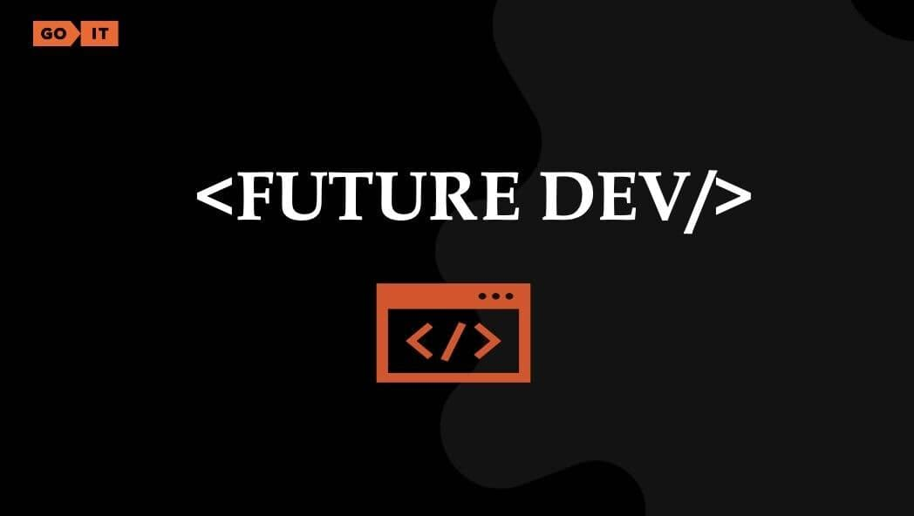
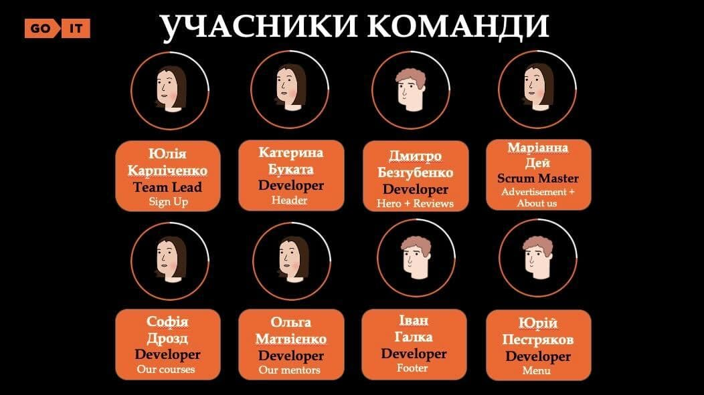
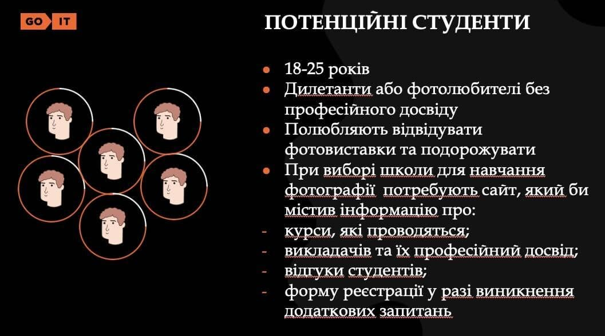

Проєкт FocusFrame створено нами - командою майбутніх розробників, яка символічно
обрала собі назву <FUTURE DEV /> (тобто, future developers).

Для організації роботи в команді нами було використано дошку в Trello під назвою
Final Team Project HTML+CSS_FocusFrame:

[trello](https://trello.com/b/xvCubDyO/final-team-project-htmlcssfocusframe)

Нижче учасники нашої команди та завдання, які кожен з нас виконував, реалізуючи
проєкт:

Сайт було виконано на запит потенційної замовниці (нижче її короткий профіль і
вимоги):

В результаті копіткої і злагодженої командної роботи отримали сайт школи
фотографії FocusFrame:

Сайт створено для потенційних студентів:

При створені сайту було використано стек технологій:

Cхематичне зображення функціоналу сайту FocusFrame:

Наш готовий проєкт -
[сайт школи фотографії FocusFrame](https://yilchik.github.io/project-future-dev/).

Нижче детальний опис функціоналу:

Header

1. В Header-і знаходиться лого, меню навігації, яке веде до відповідної секції
   та кнопка у вигляді якірного посилання "Sign up" (на мобільній версії у
   вигляді іконки-фотоапарату), яке веде до відповідної секції.
2. Меню навігації на мобільній та таблет версії відображається, як бокова
   панель, що зʼявляється. Меню реалізоване якірними посиланнями, які ведуть до
   відповідних секцій сторінки.

Hero

1. Текст "Discover the magic of photography in our school" - головний заголовок
   вебсайту.
2. Секція містить блок з описовою інформацією, якірне посилання «Our happy
   students», яке веде до розділу Reviews та іконки, що відображає загальну
   к-сть відгуків.

Advertisement

1. Заголовок секції, "Master your photography skills with us!", реалізований у
   вигляді рядка, що біжить.

About us

1. Текст "About us" - заголовок секції.
2. Зображення реалізоване як контентне.
3. У секції знаходиться детальна інформація про школу.

Our courses

1. Текст "Our courses" - заголовок секції.
2. У секції знаходиться перелік курсів, які реалізовані як нумерований список
   елементів. 3.Картка курсу складається з: номера, назви та опису курсу і
   посилання-іконки, яка реалізована, як якірне посилання, що веде до секції
   Sign up.

Our mentors

1. Текст "Our Mentors" - заголовок секції.
2. У секції знаходиться перелік менторів, який реалізований як неномерований
   список елементів.
3. Картка ментора складається з: фотокартки у вигляді контентного зображення,
   ім'я ментора, його досвіду, що вказаний у роках.

Sign up

1. Текст "Sign up" - заголовок секції.
2. Форма містить в собі елементи <input> (яким додано мінімальну валідацію даних
   для введення за допомогою атрибуту pattern).
3. Форма використовується для зв'язку з представниками школи. Для цього
   необхідно ввести ім'я, електронну адресу та повідомлення.

Reviews

1. Текст "Reviews" - заголовок секції.
2. У секції знаходиться перелік відгуків, який реалізований як список елементів.
3. Картка відгуку складається з: фотокартки у вигляді контентного зображення,
   ім'я клієнта, його статусу та враження у вигляді рейтингу.

Footer

1. У Footer-і знаходиться лого, контакти компанії, перелік посилань на соц.
   мережі, перелік якірних посилань по сайту та форма з обовʼязковим до
   заповнення елементом <input> (якому надана мінімальна валідація даних для
   введення за допомогою атрибуту pattern) та кнопка "Go".

Проєкт пройшов оцінювання на [PageSpeed Insights](https://pagespeed.web.dev/)

